<div align="center">


# Trinetra AI
### AI-Powered Emergency Intelligence & Incident Management Platform

[](https://reactjs.org/)
[](https://fastapi.tiangolo.com/)
[](https://supabase.com/)
[](https://deepmind.google/technologies/gemini/)
[](https://vercel.com/)


<br />

[Live Application](https://trinetra-ai-eight.vercel.app) · [Backend API](https://trinetra-ai-m39e.onrender.com) · [API Documentation](https://trinetra-ai-m39e.onrender.com/docs)

</div>

---
## Technology Stack

### Frontend


### Backend


### Database & Cloud


### Artificial Intelligence


### Development Tools


## Executive Overview

Emergency response and public safety command centers handle immense volumes of telemetry, reports, and critical events during large-scale gatherings and city operations. Manual triage of these events introduces latency and human error.

**Trinetra AI** is an enterprise-grade, AI-driven emergency intelligence platform engineered to autonomously monitor, classify, and prioritize incidents in real-time. By leveraging advanced pattern recognition, predictive risk modeling, and a "Memory AI" correlation engine, Trinetra AI transforms raw telemetry into actionable deployment strategies. 

Designed for smart cities, large-scale events (such as the Mahakumbh), and national disaster management operations, the platform optimizes resource allocation and significantly reduces incident response times.

---

## Why Trinetra AI Matters

Trinetra AI addresses critical bottlenecks in public safety through technological innovation:

* **Real-Time Emergency Response**: Autonomous processing reduces dispatch latency during life-threatening events.
* **AI-Assisted Triage**: Utilizing Deep Learning LLMs to eliminate manual report classification errors.
* **Cloud-Deployed Full-Stack System**: Highly available infrastructure ready for high-throughput traffic.
* **Scalable Smart City Use Case**: Built to integrate with municipal sensors, CCTV analytics, and mobile dispatch units.
* **Production-Ready APIs**: Professionally documented and secured backend services.
* **Supabase-Backed Persistence**: Reliable, scalable, and secure Postgres database management.

---

## Technical Highlights

* **Frontend**: React and TypeScript application utilizing Vite, Tailwind CSS, and Framer Motion for a fluid, zero-latency command center interface.
* **Backend**: Asynchronous FastAPI Python architecture delivering high-performance telemetry processing.
* **Database**: Supabase integration for reliable operational persistence and geographic incident mapping.
* **AI Engine**: DeepMind Gemini integration for natural language processing, priority scoring, and tactical resource recommendations.
* **Deployment**: Frontend hosted on Vercel Edge Network, Backend hosted on Render with fully resolved cross-origin (CORS) integration.
* **API Availability**: Auto-generated interactive Swagger UI documentation available at `/docs`.

---

## Feature Showcase

| Feature | Description |
| :--- | :--- |
| **AI Incident Reporting** | Natural language processing evaluates citizen reports, extracting core metadata, severity, and operational risk. |
| **Emergency Memory AI** | Correlates live sensor data against historical incident databases to predict escalations before they occur. |
| **Resource Management** | Autonomous dispatch logic that matches the nearest and most capable field units to critical incidents. |
| **Zone Intelligence** | Geographic risk profiling mapping crowd density, active incidents, and infrastructural strain. |
| **Risk Scoring** | Dynamic algorithms evaluate incoming threats and apply quantifiable priority scores for triage. |

---

## Platform Screenshots

### Mission Control Dashboard
Centralized operational overview displaying active incidents, predictive threat analytics, and resource utilization.
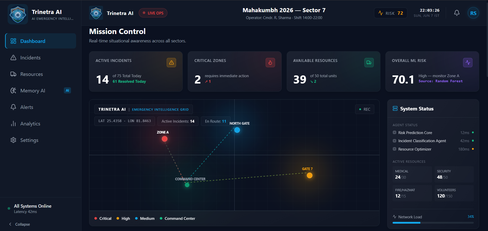

### Incident Management
Real-time feed of active emergencies with AI-generated priority scoring and tactical response recommendations.
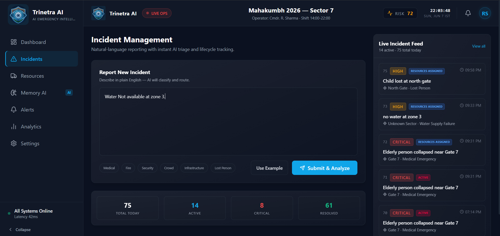

### Resource Command Center
Live tracking of available response units, medical teams, and security personnel across designated sectors.
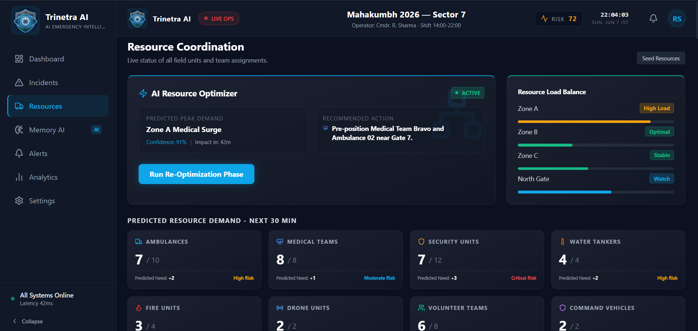

### Emergency Memory AI
Predictive intelligence engine analyzing historical patterns to detect non-obvious correlations and escalating threats.
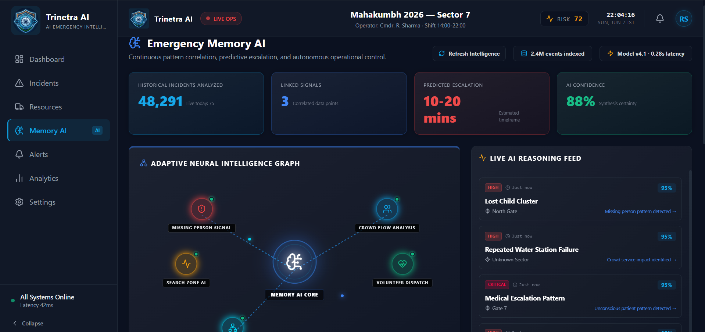

### Landing Page
Public-facing gateway for the intelligence platform.
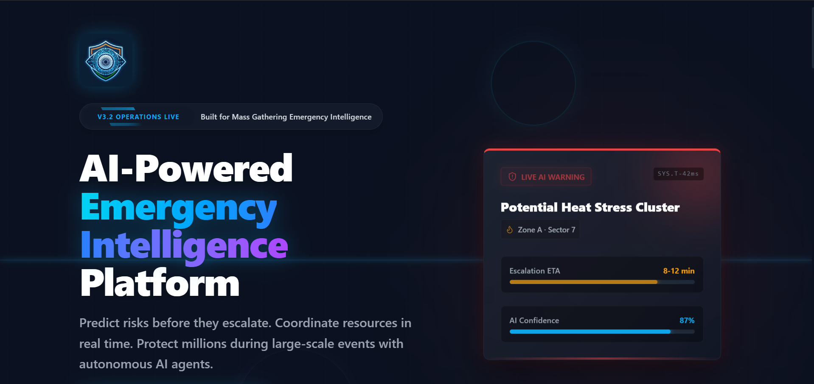

### Analytics Dashboard
Executive-level metrics tracking response times, resolution rates, and system efficiency.
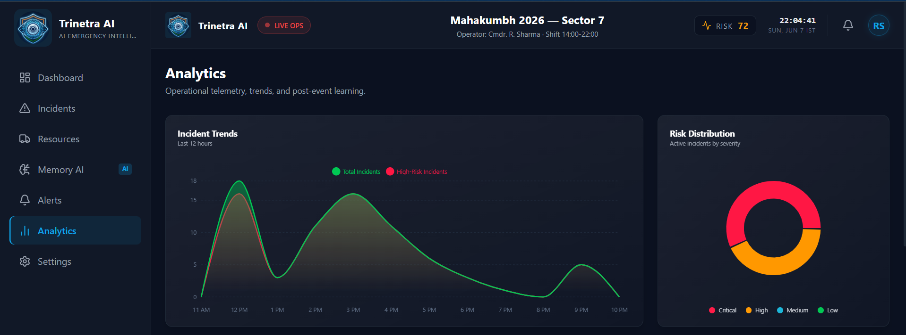

### Alerts Management
Automated public safety broadcasts and internal operational alerts.
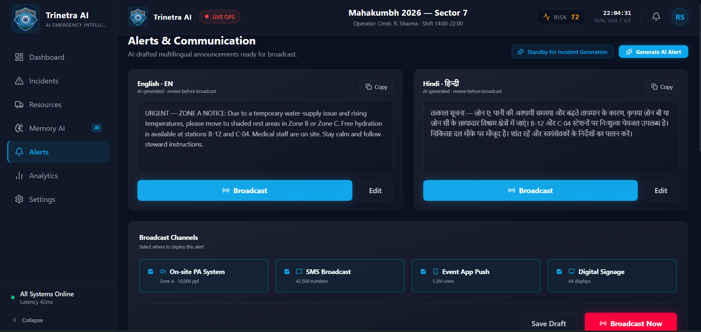

### Settings
System configuration and parameter tuning.
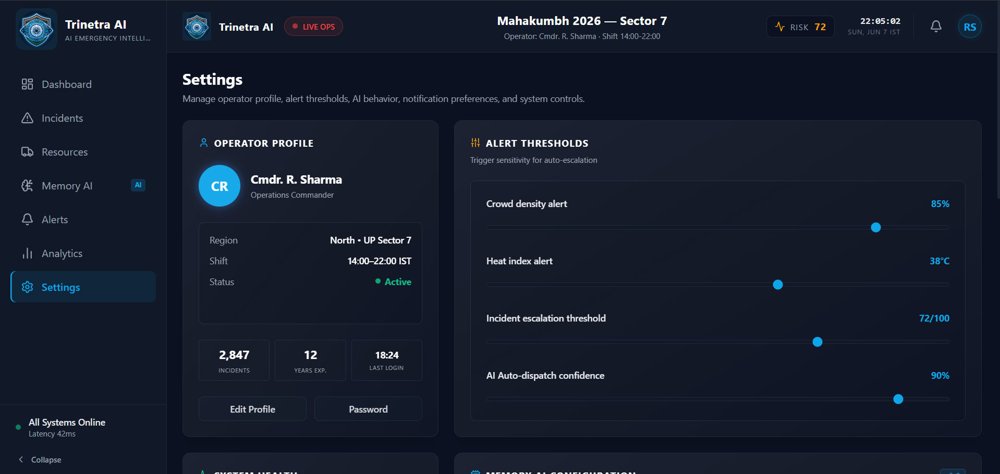

---

## Architecture Diagrams

### Main System Architecture

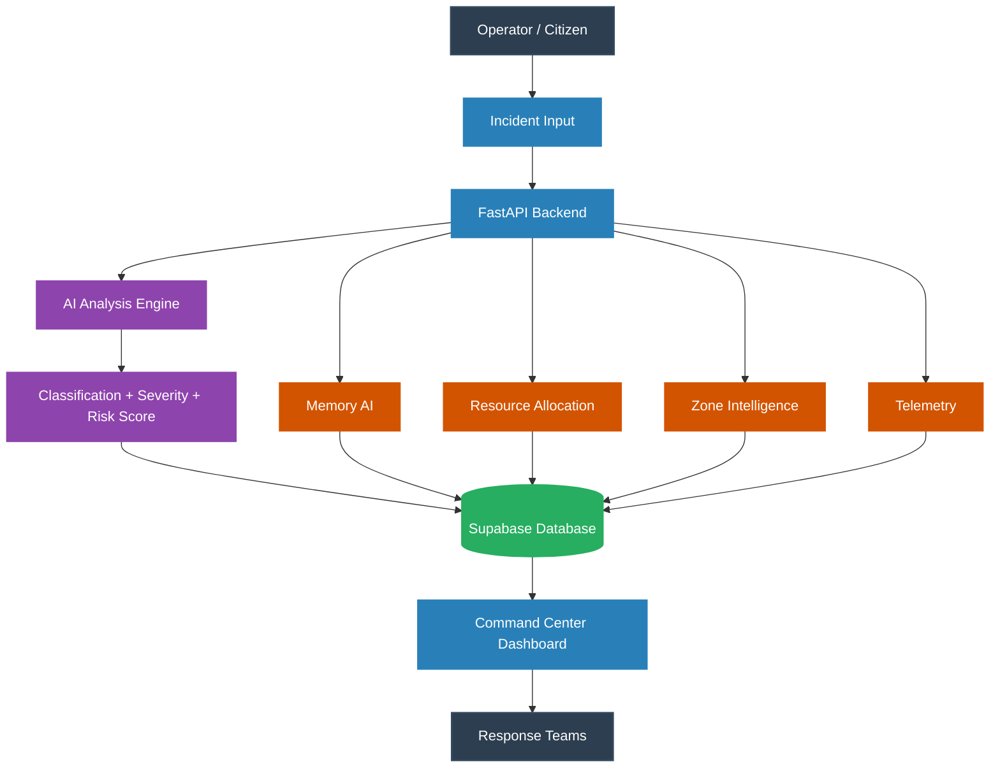

### Deployment Architecture

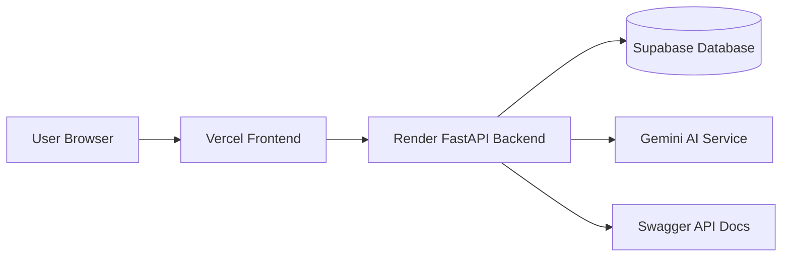

### Operational Workflow

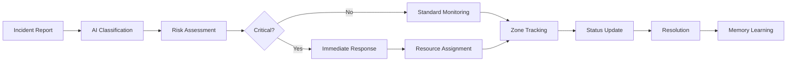

---

## Database Architecture

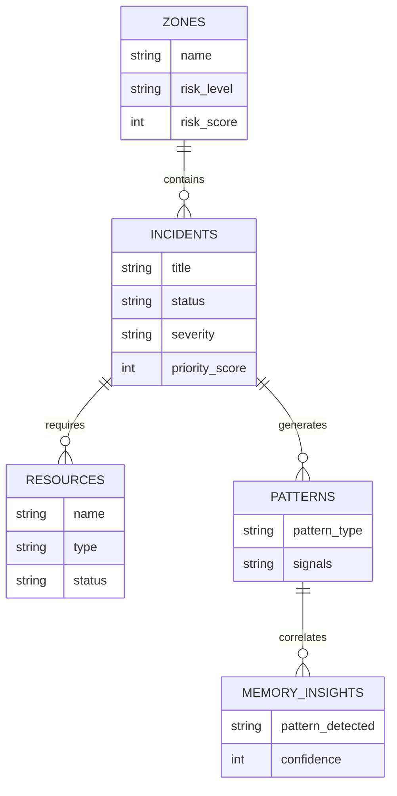


---

## Database Architecture

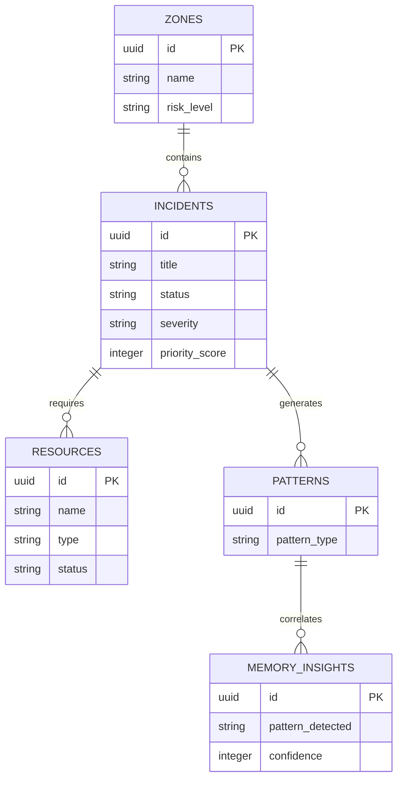

---

## API Architecture

| Method | Endpoint | Purpose | Used By |
| :--- | :--- | :--- | :--- |
| `GET` | `/api/incidents` | Retrieve all active and historical incidents | Mission Control, Incident Log |
| `POST` | `/api/incidents/create` | Register a new incident into the system | Incident Reporting Form |
| `POST` | `/api/incidents/analyze` | Process raw report text via Gemini AI | AI Triage Engine |
| `POST` | `/api/incidents/update_status` | Advance an incident through its lifecycle | Dispatchers, Response Teams |
| `GET` | `/api/resources` | Fetch all field units and operational statuses | Resource Command Center |
| `GET` | `/api/zones` | Retrieve geographical risk assessments | Tactical Map, Zone Intelligence |
| `GET` | `/api/patterns` | Fetch established historical threat patterns | Memory AI Engine |
| `GET` | `/api/memory-ai/insight` | Generate predictive insights | Dashboard, Memory AI Panel |
| `GET` | `/api/telemetry` | Stream live operational metrics | Analytics Dashboard |

---

## Project Structure

```text
trinetra-ai/
├── backend/
│   ├── models/            # Pydantic schemas and validation
│   ├── routes/            # FastAPI endpoint definitions
│   ├── services/          # Business logic, AI, and Supabase integration
│   ├── main.py            # FastAPI entry point and CORS configuration
│   └── requirements.txt   # Python dependencies
├── frontend/
│   ├── src/
│   │   ├── components/    # Reusable React components
│   │   ├── pages/         # Primary application views
│   │   ├── services/      # Axios/Fetch API wrappers
│   │   ├── App.tsx        # Router configuration
│   │   └── main.tsx       # React DOM mount
│   ├── public/            # Static assets and branding
│   ├── package.json       # Node dependencies
│   ├── tailwind.config.js # Styling configuration
│   └── vite.config.ts     # Build tooling
└── README.md
```

---

## Installation Guide

### Backend Setup

1. Navigate to the backend directory:
```bash
cd backend
```

2. Create a virtual environment and activate it:
```bash
python -m venv venv
source venv/bin/activate  # On Windows use `venv\Scripts\activate`
```

3. Install dependencies:
```bash
pip install -r requirements.txt
```

4. Environment Variables:
Create a `.env` file in the `backend` directory with the following keys:
```env
SUPABASE_URL=your_supabase_url
SUPABASE_KEY=your_supabase_key
GEMINI_API_KEY=your_gemini_api_key
```

5. Run the FastAPI server:
```bash
uvicorn main:app --reload --port 8000
```

### Frontend Setup

1. Navigate to the frontend directory:
```bash
cd frontend
```

2. Install dependencies:
```bash
npm install
```

3. Environment Variables:
Create a `.env` file in the `frontend` directory with the following keys:
```env
VITE_API_URL=http://localhost:8000
```

4. Start the development server:
```bash
npm run dev
```

---

## Author

**Somiya Namdeo**  
*B.Tech CSE (AI & ML)*  
*VIT Bhopal University*  

A passionate software engineer focused on developing intelligent, high-impact systems that leverage modern cloud architecture and applied artificial intelligence to solve critical real-world problems.

---
<div align="center">
<i>Engineered for the Future of Public Safety</i>
</div>
