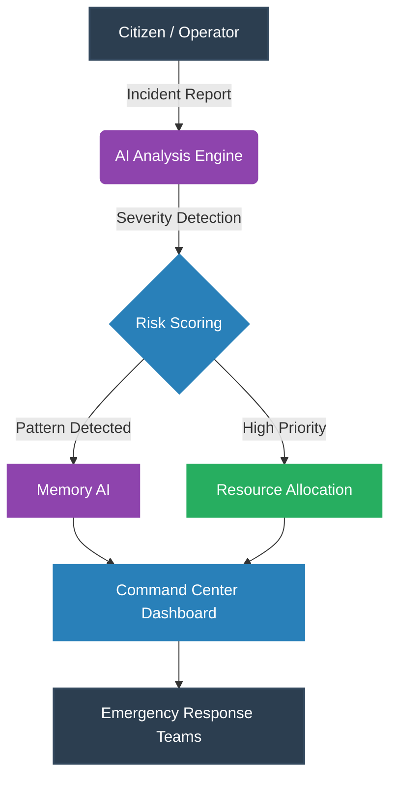
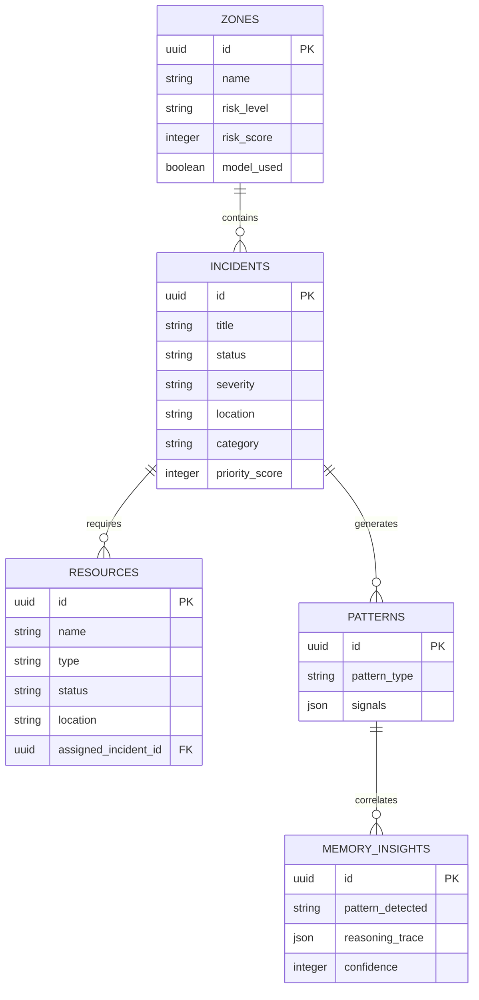

<div align="center">


# Trinetra AI
### AI-Powered Emergency Intelligence & Incident Management Platform

[](https://reactjs.org/)
[](https://fastapi.tiangolo.com/)
[](https://supabase.com/)
[](https://deepmind.google/technologies/gemini/)
[](https://vercel.com/)
[](LICENSE)
[]()

<br />

[Live Application](https://trinetra-ai-eight.vercel.app) · [Backend API](https://trinetra-ai-m39e.onrender.com) · [API Documentation](https://trinetra-ai-m39e.onrender.com/docs) · [GitHub Repository](https://github.com/)

</div>

---

## Executive Overview

Emergency response and public safety command centers handle immense volumes of telemetry, reports, and critical events during large-scale gatherings and city operations. Manual triage of these events introduces latency and human error.

**Trinetra AI** is an enterprise-grade, AI-driven emergency intelligence platform engineered to autonomously monitor, classify, and prioritize incidents in real-time. By leveraging advanced pattern recognition, predictive risk modeling, and a "Memory AI" correlation engine, Trinetra AI transforms raw telemetry into actionable deployment strategies. 

Designed for smart cities, large-scale events (such as the Mahakumbh), and national disaster management operations, the platform optimizes resource allocation and significantly reduces incident response times.

---

## Architecture Diagram



---

## Workflow Diagram


---

## Feature Showcase

| Feature | Description |
| :--- | :--- |
| **AI Incident Reporting** | Natural language processing evaluates citizen reports, extracting core metadata, severity, and operational risk. |
| **Emergency Memory AI** | Correlates live sensor data against historical incident databases to predict escalations before they occur. |
| **Resource Management** | Autonomous dispatch logic that matches the nearest and most capable field units to critical incidents. |
| **Zone Intelligence** | Geographic risk profiling mapping crowd density, active incidents, and infrastructural strain. |
| **Risk Scoring** | Dynamic algorithms evaluate incoming threats and apply quantifiable priority scores for triage. |
| **Telemetry Monitoring** | Continuous ingestion of live data across all active operational zones. |
| **Lifecycle Management** | End-to-end incident tracking from initial report through dispatch, containment, and resolution. |
| **Analytics Dashboard** | Real-time performance metrics, resource utilization rates, and operational overviews. |
| **Decision Support System** | Executive-level strategic recommendations generated by machine learning models. |

---

## Platform Screenshots

### Landing Page


### Mission Control Dashboard


### Incident Management


### Resource Command Center


### Emergency Memory AI


### Analytics Dashboard


### Alerts Management


### Settings


---

## Technology Stack

### Frontend Architecture
| Technology | Implementation Focus |
| :--- | :--- |
| **React** | Component-based UI rendering |
| **TypeScript** | Static typing and interface enforcement |
| **Vite** | Lightning-fast build tooling and HMR |
| **Tailwind CSS** | Utility-first responsive design framework |
| **Framer Motion** | High-performance fluid animations |

### Backend Architecture
| Technology | Implementation Focus |
| :--- | :--- |
| **FastAPI** | High-performance asynchronous API framework |
| **Python** | Core server logic and AI integration |
| **Uvicorn** | ASGI web server implementation |
| **Pydantic** | Data validation and settings management |

### Data & AI Layer
| Technology | Implementation Focus |
| :--- | :--- |
| **Supabase** | PostgreSQL database and real-time syncing |
| **Gemini AI** | Deep learning LLM for incident classification |

### Deployment Infrastructure
| Component | Provider |
| :--- | :--- |
| **Frontend Hosting** | Vercel |
| **Backend Hosting** | Render |

---

## Database Architecture



---

## API Architecture

| Method | Endpoint | Description |
| :--- | :--- | :--- |
| `GET` | `/api/incidents` | Retrieve all active and historical incidents |
| `POST` | `/api/incidents/create` | Register a new incident |
| `POST` | `/api/incidents/analyze` | Process raw report text through Gemini AI |
| `POST` | `/api/incidents/update_status` | Advance an incident through its lifecycle |
| `GET` | `/api/resources` | Fetch all field units and operational statuses |
| `GET` | `/api/zones` | Retrieve geographical risk assessments |
| `GET` | `/api/patterns` | Fetch established historical threat patterns |
| `GET` | `/api/memory-ai/insight` | Generate predictive insights via Memory AI |
| `GET` | `/api/telemetry` | Stream live operational metrics |

---

## Project Structure

```text
trinetra-ai/
├── backend/
│   ├── api/
│   ├── models/
│   ├── routes/
│   │   ├── alerts.py
│   │   ├── api.py
│   │   ├── incidents.py
│   │   ├── memory_ai.py
│   │   ├── resources.py
│   │   └── zones.py
│   ├── services/
│   │   ├── ai_service.py
│   │   ├── data_loader.py
│   │   ├── memory_ai.py
│   │   ├── risk_engine.py
│   │   └── supabase_service.py
│   ├── main.py
│   └── requirements.txt
├── frontend/
│   ├── src/
│   │   ├── components/
│   │   ├── data/
│   │   ├── pages/
│   │   ├── services/
│   │   │   └── api.ts
│   │   ├── App.tsx
│   │   └── main.tsx
│   ├── public/
│   ├── package.json
│   ├── tailwind.config.js
│   └── vite.config.ts
└── README.md
```

---

## Installation Guide

### Backend Setup

1. Navigate to the backend directory:
```bash
cd backend
```

2. Create a virtual environment and activate it:
```bash
python -m venv venv
source venv/bin/activate  # On Windows use `venv\Scripts\activate`
```

3. Install dependencies:
```bash
pip install -r requirements.txt
```

4. Environment Variables:
Create a `.env` file in the `backend` directory with the following keys:
```env
SUPABASE_URL=your_supabase_url
SUPABASE_KEY=your_supabase_key
GEMINI_API_KEY=your_gemini_api_key
```

5. Run the FastAPI server:
```bash
uvicorn main:app --reload --port 8000
```

### Frontend Setup

1. Navigate to the frontend directory:
```bash
cd frontend
```

2. Install dependencies:
```bash
npm install
```

3. Environment Variables:
Create a `.env` file in the `frontend` directory with the following keys:
```env
VITE_API_URL=http://localhost:8000
```

4. Start the development server:
```bash
npm run dev
```

---

## AI Intelligence Engine

Trinetra AI employs a multi-layered artificial intelligence approach to emergency management:

* **Incident Classification**: Utilizes Large Language Models (LLMs) to ingest unstructured reporting data and extract structural taxonomies (e.g., Medical, Fire, Crowd Surge).
* **Severity Analysis**: Contextualizes reporting vocabulary and infrastructural proximity to determine the immediate threat level.
* **Risk Assessment**: Continuously evaluates geographic zones against live telemetry to score regional instability.
* **Memory Correlation**: Cross-references incoming data against a persistent vector database of historical incidents to identify escalating threat signatures.
* **Pattern Detection**: Monitors frequency graphs to identify distributed, non-obvious operational anomalies.
* **Resource Recommendation**: Calculates the optimal unit dispatch based on proximity, capability, and current deployment status.

---

## Scalability & Real-World Applications

Trinetra AI is engineered for high-throughput, high-stakes environments:

* **Smart Cities**: Integration with municipal IoT grids for centralized urban oversight.
* **Disaster Management**: Rapid deployment coordination during natural disasters.
* **Police Operations**: Force multiplication through predictive threat deployment.
* **Healthcare Emergencies**: Optimized routing for ambulance and medical triage teams.
* **Crowd Control**: Predictive density management for high-capacity venues.
* **Government Command Centers**: Unified operational intelligence for state and federal agencies.
* **Public Events**: Dedicated telemetry monitoring for concerts, protests, and parades.
* **Mahakumbh Scale Deployments**: Built specifically to handle the immense logistical and safety requirements of the world's largest human gatherings.

---

## Security & Reliability

* **Input Validation**: Strict schema enforcement via Pydantic on all API endpoints.
* **Secure APIs**: CORS middleware configuration and environment-isolated credentials.
* **Fault Tolerance**: Fallback mechanisms utilizing local JSON indexing if the primary Supabase cluster experiences downtime.
* **Monitoring**: Integrated telemetry tracking for API latency and error rates.
* **Error Handling**: Graceful frontend degradation with localized error boundaries protecting core dashboard functionality.

---

## Future Roadmap

* **Computer Vision**: Integration with live IP camera feeds for autonomous anomaly detection.
* **CCTV Analytics**: Behavioral analysis algorithms for crowd panic and weapon detection.
* **GIS Mapping**: Advanced geospatial layers detailing exact infrastructure routing and topology.
* **Predictive Risk Forecasting**: Long-term machine learning models projecting threats hours in advance.
* **Drone Surveillance**: API integrations for automated drone dispatch and aerial telemetry ingestion.
* **Mobile Responder App**: Dedicated progressive web application for field units to update statuses natively.
* **Multi-Language Support**: Complete localization of all intelligence interfaces and alerts.
* **LLM-Based Command Assistant**: A conversational interface allowing commanders to query live databases using natural language.

---

## Why This Project Stands Out

* **Full-Stack Engineering**: A complete, end-to-end operational platform combining a React/TypeScript frontend with a Python/FastAPI backend.
* **Production Deployment**: fully deployed and accessible live via Vercel and Render cloud infrastructure.
* **AI Integration**: Meaningful application of AI (Gemini) that directly solves real-world triage bottlenecks, rather than simple chatbot wrappers.
* **Emergency Intelligence Domain**: Addresses a critical, high-impact public sector problem with a scalable technological solution.
* **Scalable Architecture**: Built on modern, stateless principles allowing for horizontal scaling under extreme load.
* **Real-Time Data Processing**: Asynchronous backend architecture specifically designed for low-latency operational environments.
* **Modern Cloud Infrastructure**: Leveraging Supabase for robust PostgreSQL data persistence and real-time capabilities.

---

## Author

**Somiya Namdeo**  
*B.Tech CSE (AI & ML)*  
*VIT Bhopal University*  

A passionate software engineer focused on developing intelligent, high-impact systems that leverage modern cloud architecture and applied artificial intelligence to solve critical real-world problems.

---
<div align="center">
<i>Engineered for the Future of Public Safety</i>
</div>
